# 角度探险家 · 四年级数学互动课堂

> 面向人教版小学四年级上册“角的度量”相关课时的本地优先课堂应用。学生先观察角，再用量角器验证，最后把转向角度写进机器人路线和双人竞赛。

## 先看成品

应用是一个单页课堂工具，打开后不需要账号、服务器或安装程序。推荐教师在一体机浏览器中进入全屏；学生的操作、积木程序和比赛记录只在当前页面运行，不会上传姓名、答案或成绩。

### 一次课可以怎样用

1. **角度实验室**：先隐藏度数，请学生拖动活动边估角，再打开量角器和数字盘核对。切换左右基准边，比较内外两圈刻度。
2. **机器人餐厅**：把“直行、左转、右转、重复”积木拖进程序，完成取餐口 → 餐桌 → 取餐口的路线。用“下一条”让学生预测下一步，用 Python 视图对照缩进。
3. **角度挑战**：全班共答适合讲解；双人同屏赛适合两位学生上屏比赛。每题独立计时，双方都答完后才显示比赛结果，教师再打开答案解析。

## 课堂界面图集

图片按当前版本重新截取。点击任意缩略图可查看原图，适合备课时放大确认按钮、字级和触控区域。

<table>
<tr>
<td width="50%"><a href="docs/images/01-restaurant.png">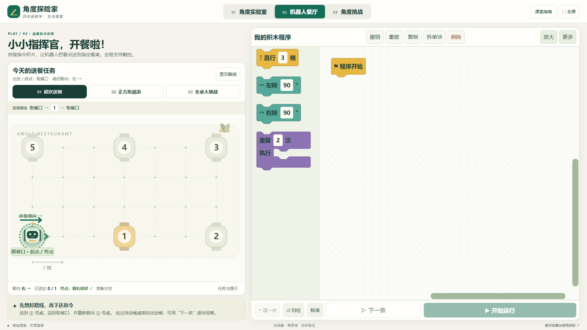</a> <b>01 · 机器人餐厅</b> 左侧地图显示取餐口、餐桌和停靠朝向；右侧是可拖动的 Blockly 编程区。</td>
<td width="50%"><a href="docs/images/02-angle-lab.png">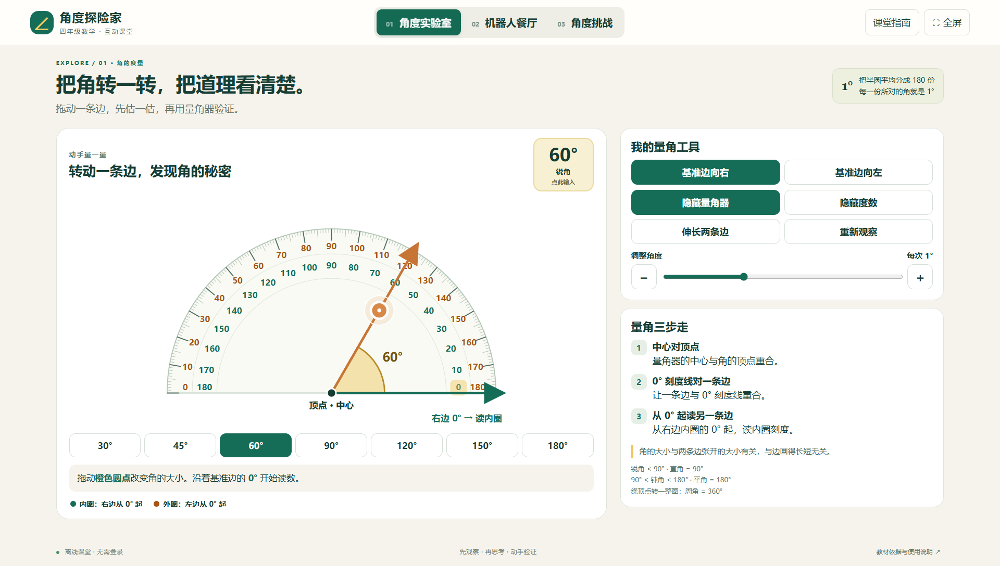</a> <b>02 · 角度实验室</b> 拖动橙色圆点改变活动边，观察角的开口变化，再用量角器读数。</td>
</tr>
<tr>
<td><a href="docs/images/03-touch-keypad.png">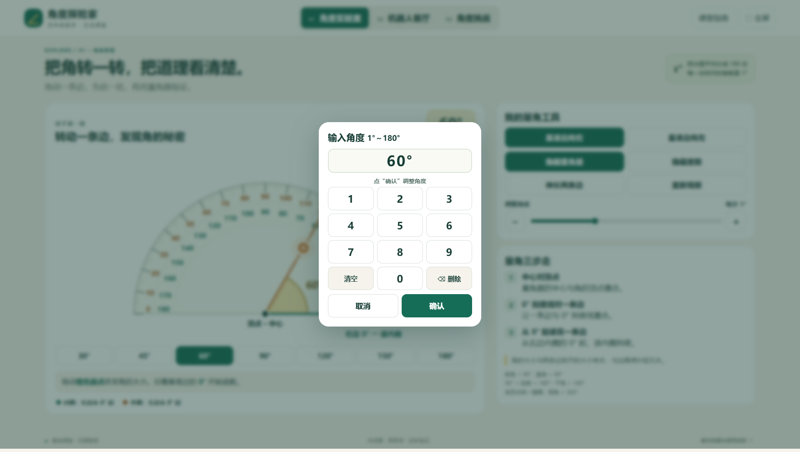</a> <b>03 · 触屏数字盘</b> 点积木中的白色数字或角度读数即可输入，不依赖系统键盘。</td>
<td><a href="docs/images/04-block-loop.png">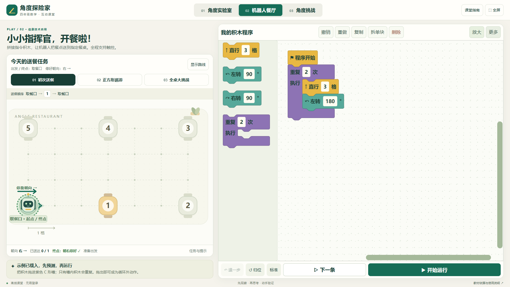</a> <b>04 · C 形循环</b> 只有放进 C 形槽的动作会重复；循环外的积木仍按顺序执行。</td>
</tr>
<tr>
<td><a href="docs/images/05-resume-trial.png">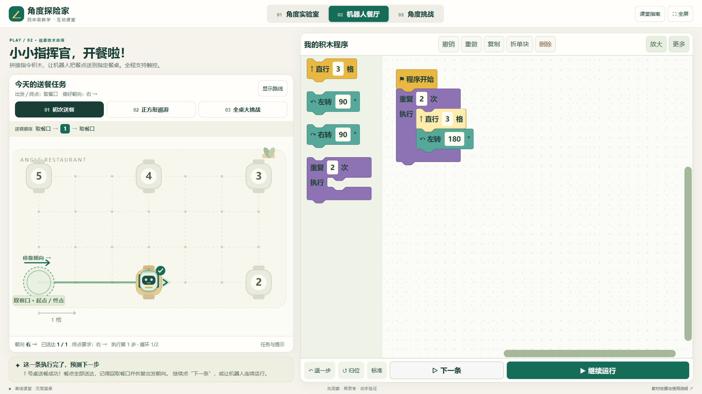</a> <b>05 · 保留现场继续试</b> 补写返程指令后可以“接着试”，不必从零重新播放已经验证的前缀。</td>
<td><a href="docs/images/06-duel-ready.png">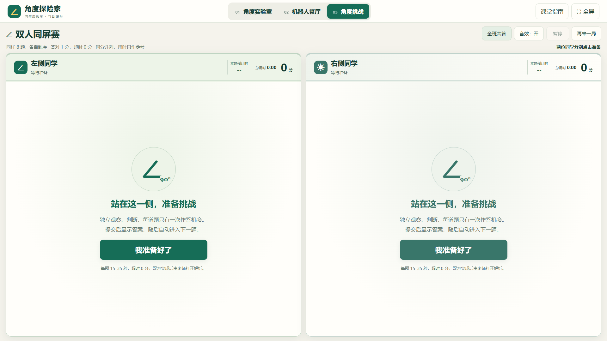</a> <b>06 · 双人同屏准备</b> 两侧学生分别点击“我准备好了”，双方都准备后统一倒数开赛。</td>
</tr>
<tr>
<td><a href="docs/images/07-duel-feedback.png">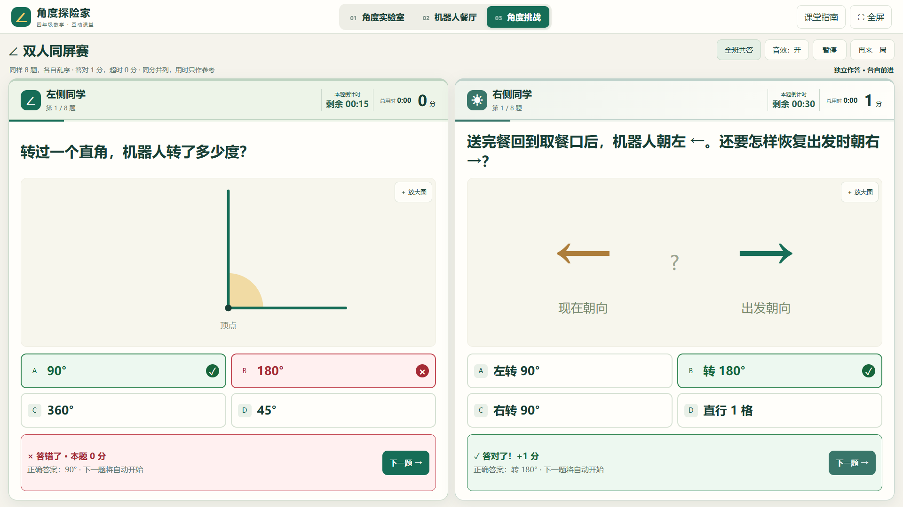</a> <b>07 · 逐题公示</b> 提交后立刻显示本题正确选项和对错，约 1.2 秒后自动进入下一题。</td>
<td><a href="docs/images/08-duel-result.png">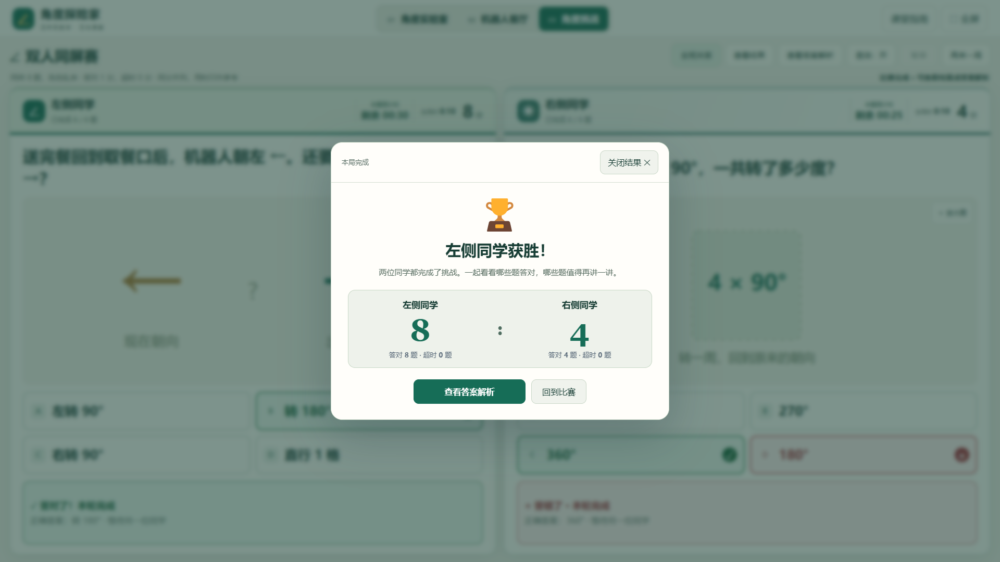</a> <b>08 · 比赛结果</b> 两人全部完成后才出现得分、答对数、超时数和轻量庆祝动画。</td>
</tr>
<tr>
<td><a href="docs/images/09-teacher-review.png">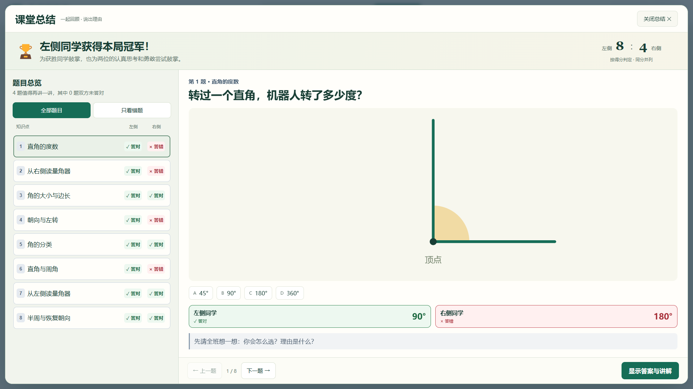</a> <b>09 · 教师讲评</b> 先看双方选项和“✓ 答对 / × 答错 / ⌛ 超时”，教师按需展开正确答案与解析。</td>
<td><a href="docs/images/10-narrow-screen.png">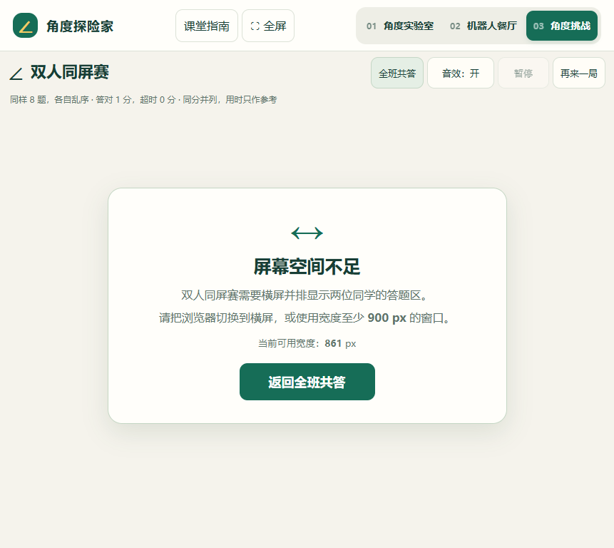</a> <b>10 · 窄屏提示</b> 宽度小于 900 px 时明确提示空间不足，不再留下空白比赛区。</td>
</tr>
<tr>
<td><a href="docs/images/11-python-view.png">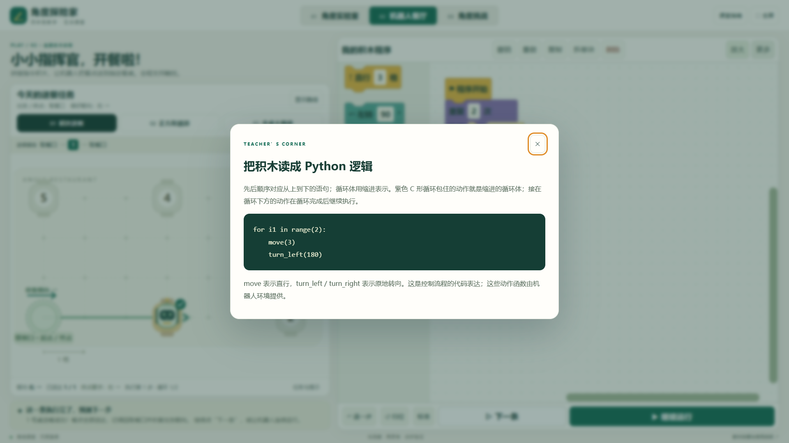</a> <b>11 · Python 逻辑</b> 用代码的顺序和缩进解释积木，帮助学生理解循环的开始、范围和结束。</td>
<td><a href="docs/images/12-class-quiz.png">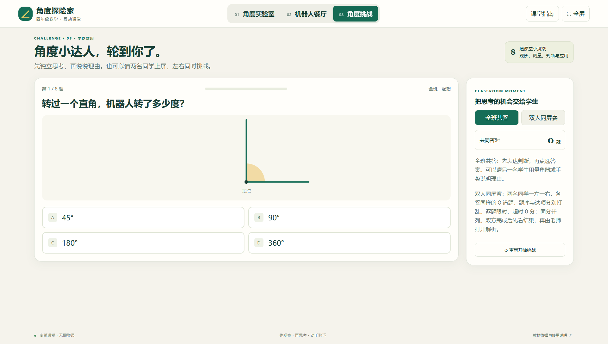</a> <b>12 · 全班共答</b> 教师可逐题停留、邀请学生说理由，再公布答案并继续下一题。</td>
</tr>
</table>

## 下载与运行

### 在线版

打开 [GitHub Pages 在线版](https://misaka16180.github.io/angle-adventure-classroom/)，在浏览器中按右上角“全屏”。在线版适合备课、演示和更新后的快速体验。

### 离线版

在 [Releases](https://github.com/misaka16180/angle-adventure-classroom/releases/latest) 下载 `angle-adventure-classroom-offline.zip`，解压后直接打开其中的 `角度探险家.html`（Release 同时提供 `angle-adventure-classroom.html` 单文件）。也可以只把该 HTML 文件复制到 U 盘或教师电脑；核心脚本、Blockly 和图标已经内嵌，不依赖网络。

离线包附有教师使用指南、使用说明、`images/` 中的完整截图和 `THIRD-PARTY-NOTICES.txt`。阅读图文指南时请保留解压后的目录结构；重新分发应用时请一并保留第三方声明。

## 大屏与触控要求

- 推荐 **横屏 1920×1080 全屏**，现代版 Chrome 或 Edge；1366×768、1920×1200 和 4K 横屏也可使用。
- 900 px 是“双人同屏赛”左右并排布局的最低宽度，不是全应用的最低分辨率。小于 900 px 时会显示可操作的窄屏提示，并可返回全班共答。
- 像素分辨率不等于一体机的物理尺寸。Windows 显示缩放、浏览器缩放、浏览器工具栏都会减少网页可用区域；建议系统缩放合适、浏览器缩放 100%，再点应用内“全屏”。
- 应用的按钮、量角器拖柄、选项和数字盘按触控设计；不要求鼠标和键盘。双人比赛能否真正同时识别两根手指还取决于一体机硬件的多点触控能力。
- 浏览器标签页切走或窗口失焦时，双人赛会自动暂停；回到页面后点击“继续”。

## 功能要点

### 角度实验室

拖动活动边可以连续改变角度，读数实时更新。角度范围为 1°—180°；提供加减 1°、滑杆、常用角度按钮和触屏数字盘。可切换从左边或右边读量角器，显示或隐藏双圈刻度，观察边长变化而角度不变。画面支持键盘方向键，但课堂操作不依赖键盘。

### 机器人餐厅

机器人从左下方的**取餐口**出发，初始朝右。完成关卡必须满足三件事：按规定顺序送达目标桌、回到取餐口、恢复朝右停靠。经过非当前目标桌时不会提前送餐，并会在反馈中说明顺序问题。

当前三关：

| 关卡 | 送餐顺序 | 学习重点 |
| --- | --- | --- |
| 初次送餐 | ① → 取餐口 | 180° 回转、起点与终点朝向 |
| 正方形巡游 | ① → ④ → ⑤ → 取餐口 | 90° 转向与循环 |
| 全桌大挑战 | ① → ② → ③ → ④ → ⑤ → 取餐口 | 合并直行距离、规划完整路线 |

积木支持拖入、吸附、重排、拆单块、复制、删除、撤销、重做、缩放和平移。循环最多嵌套 4 层；每个循环 1—8 次；最多连接 40 个直行或转向积木，展开后最多执行 128 条动作。点击“更多 → 看 Python 逻辑”可查看等价的 `move()`、`turn_left()`、`turn_right()` 和 `for` 缩进。方格餐厅只能沿横线或竖线直行；输入其他转角后，需要先转回上、下、左、右方向再前进。

### 角度挑战

全班共答模式不强制倒计时，适合全班先判断、再解释。双人同屏赛使用同一题库，但左右两侧的题序和选项顺序分别打乱；每题限时随难度为 15—35 秒，答对 1 分，答错或超时 0 分。提交后立即公示本题答案并自动切题；一方完成后只等待另一方，双方全部完成后才弹出比赛结果。教师点击“查看答案解析”进入总结，可筛选全部题目或错题，逐题展开解析。

正确与错误的颜色在左右两侧含义一致：绿色表示答对，红色表示答错或超时，不能用左右位置推断对错。

## 教师文档

- [教师使用指南](docs/TEACHER_GUIDE.md)：按一节 35—45 分钟的课给出流程、提问和双人赛复盘方式。
- [离线课堂使用说明](docs/使用说明.md)：给上课教师的快速打开、操作和触控提示。
- [开发与维护说明](docs/DEVELOPMENT.md)：目录、构建、测试、截图更新、GitHub Pages 和离线包发布流程。

## 教材依据与边界

应用围绕人民教育出版社小学数学四年级上册“角的度量”设计，涉及角的大小与边长无关、度量单位“度”、直角 90°、平角 180°、周角 360°、量角器读数和机器人转向。机器人餐厅是把教材中的信息技术应用转成可操作的课堂模拟，不是人教社官方数字教材；图形和题目插图由本项目自行绘制。教材入口可见 [人民教育出版社教材电子版](https://jc.pep.com.cn/)。

## 许可证与第三方声明

本仓库目前未额外授予一份新的开源许可证，请在公开使用、再分发或二次开发前联系项目维护者确认授权范围。Blockly 及相关资源遵循其原有 Apache License 2.0 等条款；具体版权和通知见 [app/THIRD-PARTY-NOTICES.txt](app/THIRD-PARTY-NOTICES.txt)。教材名称和相关链接仅用于教学来源说明。

## 反馈

请在 GitHub Issues 中附上浏览器版本、窗口 CSS 宽高、系统缩放比例、是否触屏，以及能复现问题的操作步骤。课堂照片中请先遮挡学生姓名、头像和成绩。
